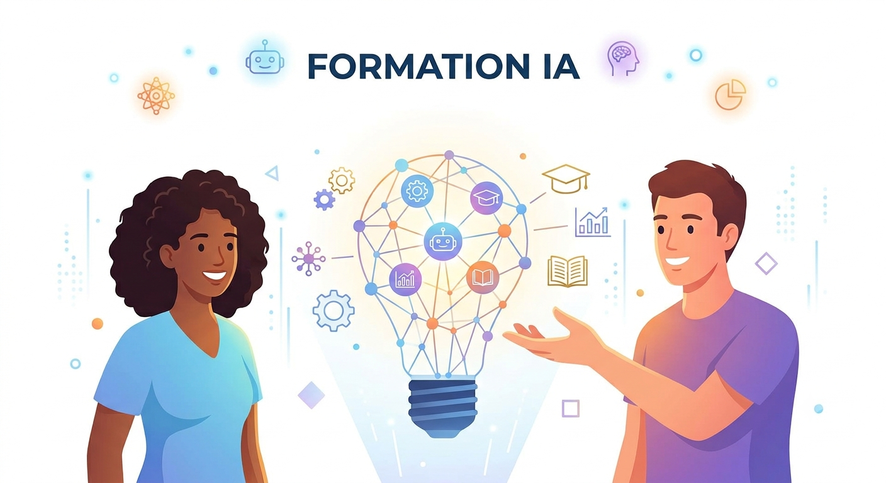

# Bienvenue

Ce site regroupe toutes les ressources de votre formation IA générative, préparée dans le cadre de la certification **RS6776**.

- **Certification RS6776** — Présentation de la Certification RS6776
- **Sources officielles** — Cette page regroupe les sources à consulter pour vérifier les informations importantes du wiki
- **Formation** — les 8 séances H0 à H7, dans l'ordre du parcours
- **Fiches outils** — une fiche par assistant IA (ChatGPT, Claude, Gemini, Mistral, Copilot, Perplexity) et la fiche méthode 4D Fluency
- **Glossaire** — les codes utiles à insérer dans vos prompts (FALC, ROFT, CROFT...)
- **Articles** — un espace qui s'enrichit au fil du temps, en dehors du parcours structuré

!!! tip "Astuce"
    Utilisez la barre de recherche en haut de la page pour retrouver une méthode ou un exemple de prompt en quelques secondes.
