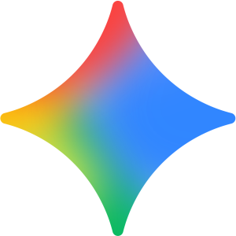

# Gemini

  

    
  

  

    <h1 style="margin: 0 0 8px 0; border: none; padding: 0;">Mistral</h1>
    <a href="https://gemini.google.com" target="_blank" rel="noopener" class="md-button md-button--primary" style="font-size: 12px; padding: 4px 12px; font-weight: 600;">
      🌐 Accéder à l’outil (gemini.google.com) ↗
    </a>
  

---

## 🎯 À quoi sert Gemini ?

- **Écrire plus vite** : mails, documents, premiers brouillons.
- **Résumer et expliquer** : simplifier un sujet, résumer un contenu.
- **Chercher et organiser** : brainstorming, planification.
- **Travailler dans Google** : Gmail, Docs, Sheets, Slides, Drive selon la formule.
- **Traiter plusieurs formats** : texte, images, code, audio, vidéo.

---

## ✅ Ce que Gemini fait bien

- Chercher des idées et organiser un plan de travail.
- Aider à écrire, corriger et reformuler.
- S’intégrer à Google Workspace pour travailler directement dans les outils.
- Gérer plusieurs formats (texte, images, code, audio, vidéo).
- Utiliser **Canvas** pour écrire, coder ou construire un premier prototype.

---

## 💬 5 exemples de demandes utiles

- « Rédige un mail poli pour relancer un client qui n’a pas encore répondu à ma proposition. »
- « Résume ce document en 5 points simples, avec un ton clair et professionnel. »
- « Prépare un ordre du jour de 30 minutes avec les points à traiter et les questions à poser. »
- « Donne-moi 10 idées de publication LinkedIn pour parler de mon activité de façon simple et utile. »
- « Explique-moi la différence entre un tableur et une base de données avec des mots simples et un exemple. »

---

## ⭐ Les plus de Gemini

- Permet d’écrire, résumer, organiser et chercher des idées rapidement.
- Très pratique si vous utilisez déjà Gmail, Docs, Sheets, Slides ou Drive au quotidien.
- **Gems** : assistants personnalisés avec consignes réutilisables.
- Conversation vocale, partage d’écran ou de caméra selon les usages pris en charge.

---

## ⚠️ Limites de Gemini

- Certaines options ne sont pas disponibles dans toutes les formules ou régions.
- Limites d’usage selon le type de demande et la longueur des échanges.
- Les réponses peuvent être inexactes : toujours relire et valider.
- Outil particulièrement optimisé pour l’univers Google, moins pour des environnements totalement externes.

---

## 🧭 Bien écrire sa demande à Gemini

1. **Être précis**  
   Dire clairement ce que vous voulez obtenir.

2. **Donner du contexte**  
   Décrire la situation, le public visé et le but du document.

3. **Demander un format**  
   Préciser la forme : liste, mail, tableau, plan, résumé.

4. **Indiquer le ton**  
   Simple, professionnel, rassurant, pédagogique, etc.

!!! example "Exemple de demande"
    Au lieu de « Écris un mail », demander :  
    « Rédige un mail poli de 120 mots pour relancer un client après une absence de réponse. »

---

## 🕒 Quand choisir Gemini ?

Choisir Gemini si vous travaillez déjà avec **Gmail, Docs, Sheets, Slides, Drive ou Meet**, que vous voulez écrire plus vite, chercher des idées ou disposer d’un outil simple et intégré à votre environnement Google.
